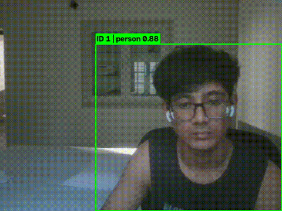

# CodeAlpha - Object Detection and Tracking

Real-time object detection and multi-object tracking using YOLOv8
(Ultralytics) with built-in ByteTrack, drawing bounding boxes, class
labels, and persistent track IDs on a webcam feed or video file.

## Overview

This project uses a pretrained YOLOv8 model to detect objects frame-by-frame,
and ByteTrack (Ultralytics' built-in tracker) to associate detections across
frames into persistent tracked objects, each with a unique ID.

## Demo



## Project Structure

```
Object-Detection-Tracking-Project/
├── detect_track.py     # Main detection + tracking script
├── requirements.txt
└── README.md
```

## Setup

```bash
python -m venv venv
venv\Scripts\activate       # Windows
# source venv/bin/activate  # macOS/Linux

pip install -r requirements.txt
```

YOLOv8 model weights (e.g. `yolov8n.pt`) are downloaded automatically by
Ultralytics on first run — no manual download needed.

## Usage

### Webcam (default)

```bash
python detect_track.py --source 0
```

### Video file

```bash
python detect_track.py --source path/to/video.mp4
```

### Save annotated output

```bash
python detect_track.py --source path/to/video.mp4 --save
```

Saves the annotated video to `output.mp4`.

### Optional arguments

| Argument      | Default          | Description                                                        |
|---------------|------------------|----------------------------------------------------------------------|
| `--source`    | `0`              | `0` for webcam, or path to a video file                              |
| `--model`     | `yolov8n.pt`     | YOLO weights — try `yolov8s.pt`/`yolov8m.pt` for higher accuracy      |
| `--tracker`   | `bytetrack.yaml` | Tracker config — `bytetrack.yaml` or `botsort.yaml`                   |
| `--conf`      | `0.4`            | Confidence threshold for detections                                  |
| `--classes`   | `None` (all)     | Comma-separated class IDs to keep, e.g. `'0,2'` (person, car)         |
| `--save`      | off              | Save annotated output video to `output.mp4`                          |

Press `q` to quit the live display window.

## How it works

1. `model.track()` streams frames from the source and runs YOLOv8 detection
   on each one.
2. ByteTrack associates detections across frames, assigning each object a
   persistent track ID (so the same object keeps the same ID as it moves).
3. Each frame is annotated with a bounding box, class label, confidence
   score, and track ID, then displayed (and optionally saved) in real time.

## Requirements

- Python 3.9+
- ultralytics >= 8.2.0
- opencv-python >= 4.9.0
- lap >= 0.4.0

See `requirements.txt` for exact versions.

## Notes

- `yolov8n.pt` (nano) is the fastest/smallest model, good for real-time
  performance on CPU. Larger variants (`s`, `m`, `l`, `x`) trade speed for
  accuracy.
- Class IDs follow the COCO dataset convention (e.g. `0` = person,
  `2` = car). See the [COCO class list](https://docs.ultralytics.com/datasets/detect/coco/)
  for the full mapping.

## Part of the CodeAlpha Internship

This is Task 4 of the CodeAlpha AI internship program. The companion
project, **Music Generation with AI**, is available in a separate
repository: [CodeAlpha_Music-Generation-AI](https://github.com/arwindominic17-hub/CodeAlpha_Music-Generation-AI)
